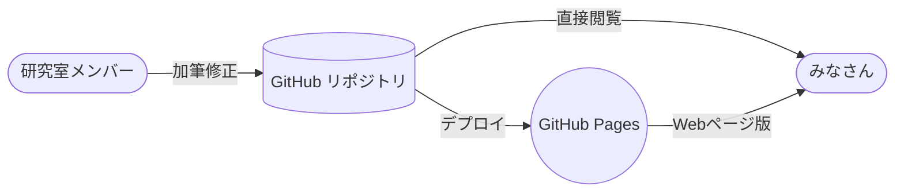

## 利用案内

**TakiWiki3** は [GitHub](https://github.com/) と [GitHub Pages](https://docs.github.com/en/pages/getting-started-with-github-pages/about-github-pages) を利用して運用されています。

### 閲覧方法

[GitHub リポジトリ](https://github.com/takimotolab/takiwiki3)で直接読む方法と、[GitHub Pages](https://takimotolab.github.io/takiwiki3/) で読む方法があります。
それぞれ以下のような特徴がありますが、GitHub に不慣れな人は Pages の方が使いやすいかもしれません。

- GitHub リポジトリ

  [https://github.com/takimotolab/takiwiki3](https://github.com/takimotolab/takiwiki3)

  - Web上のUIからすぐに編集ができる
  - 全てのファイルが見られるので探しやすく見落としにくい
  - GitHubのUIが邪魔に感じられるかもしれない

- GitHub Pages

  [https://takimotolab.github.io/takiwiki3/](https://takimotolab.github.io/takiwiki3/)

  - 通常のWebページと同じ使用感
  - 編集はできない

### 編集方法

> **Warning:** **内部向け**
> 
> この項はOrganization内部向けです。誰でも編集できるわけではありません。
> 
> ここがもっと知りたいであるとか、誤字脱字や誤りをご指摘いただく際は、お手数ですが **PR** か **Issue** でお願いします。

Web上のエディタを使う方法と、ローカル(自分の手元の端末)で行う方法があります。

- GitHub Webエディタでの編集

  リポジトリで編集したいファイルを見たとき、鉛筆などのアイコンがあると思うのでそこから編集してください。
  何を変更したのかわかりやすいコミットメッセージを付けることで、あとから変更過程を追いやすくなります。

- ローカルでの編集

  [リポジトリ](https://github.com/takimotolab/takiwiki3)を `clone` し、編集後 `push` してください。

  あくまで少人数が編集する身内Wikiであることから `main` ブランチに直接 `push` して構いません。

### 技術情報

**TODO**: `_includes/**` と `_config.yml` について書く
