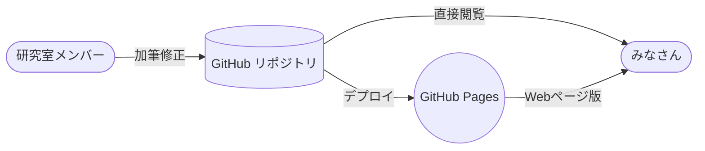

## 技術情報

**TakiWiki3** は[GitHub](https://github.com/)と[GitHub Pages](https://docs.github.com/en/pages/getting-started-with-github-pages/about-github-pages)を利用して運用されています。

研究室メンバーがGitHubに記事を`push`すると、自動でGitHub PagesにデプロイされてWebページとしても閲覧できるようになるという流れです。



GitHub Pagesでは、[Jekyll](https://jekyllrb.com/)という静的サイトジェネレータが利用されています。
なるべく保守の手間がかからないようにカスタムは少なめですが、いくつか設定した項目があるので書き残しておきます。

### _config.yml

YAMLで書かれたJekyllの設定ファイルです。

詳しくは[Configuration | Jekyll • Simple, blog-aware, static sites](https://jekyllrb.com/docs/configuration/)をご覧いただくとして、2023年5月現在、設定されているのは次の項目です。

- lang

  言語設定です。なくてもおそらく問題ありませんが、念のために。

- description

  `<meta>`タグの`description`です。Google検索などの説明部分に表示されるはずです。

- title
  
  Jekyllの設定で、サイトとページのタイトルが一致しないとサイトタイトルのヘッダが表示されてしまいます。
  トップページでは重複するので表示されてほしくないですが、サイトタイトルはデフォルトでリポジトリ名なので大文字小文字が合いません。
  そのため、別途ここで設定しています。

### _includes/head-custom.html

デフォルトで使われるJekyll themeの[Primer](https://github.com/pages-themes/primer)では、このファイルの内容が`<head>`タグに追記されます。
`MathJax`や`Mermaid`といったライブラリを利用するための初期化コードなどを次のように記入しています。

```html
<!-- Primer Theme ではこのファイルが自動でレンダ結果の<head>タグ内に展開される -->
<!-- MathJaxを動かすために必要 -->
<script src="https://polyfill.io/v3/polyfill.min.js?features=es6"></script>
<script id="MathJax-script" async src="https://cdn.jsdelivr.net/npm/mathjax@3/es5/tex-mml-chtml.js"></script>
<!-- ダイアグラムなどを描画するMermaidの初期化 -->
<script type="module">
  import mermaid from 'https://cdn.jsdelivr.net/npm/mermaid@10/dist/mermaid.esm.min.mjs';
  mermaid.initialize({ startOnLoad: false });
  await mermaid.run({
    querySelector: 'pre > code.language-mermaid', // GitHub Flavored Markdownに合わせる
  });
</script>
```
